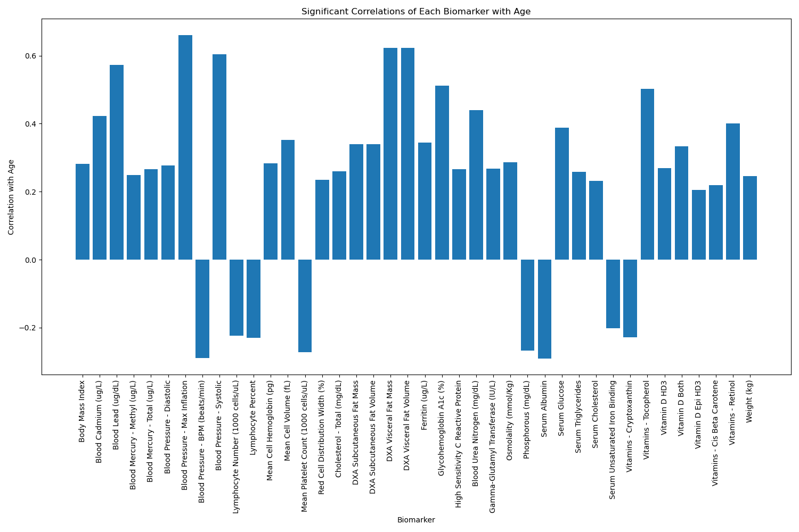
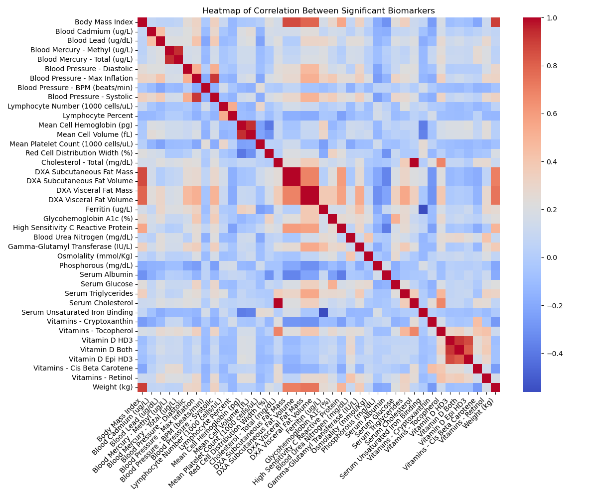
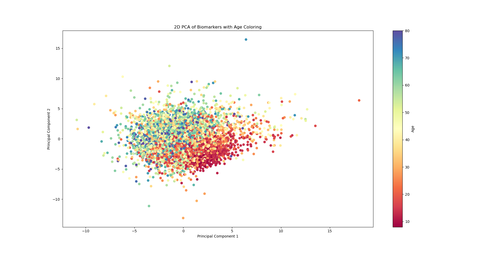
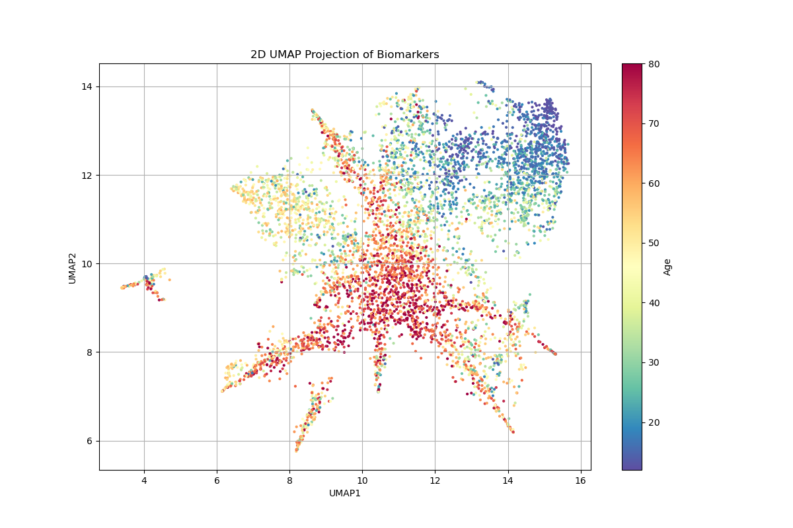
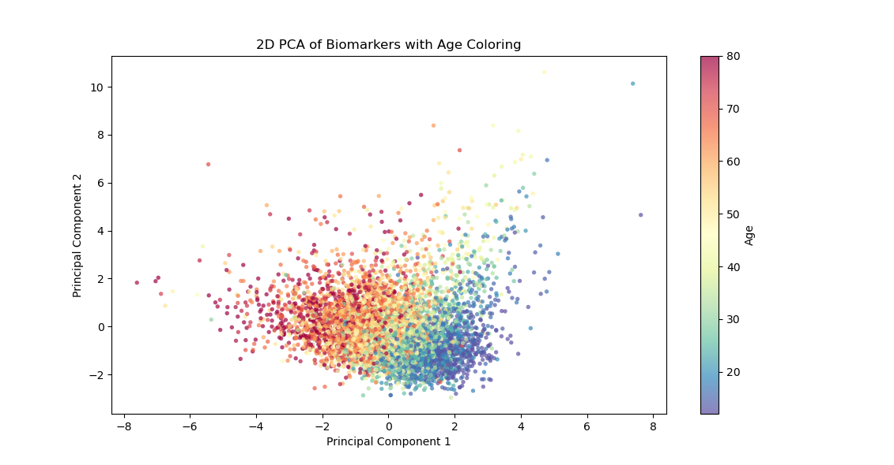
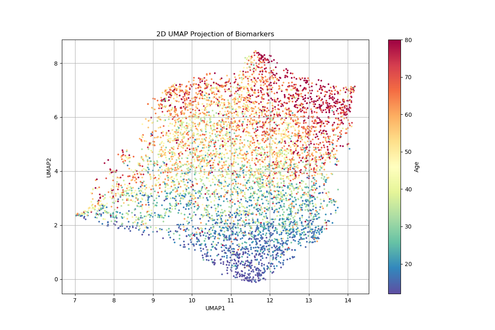
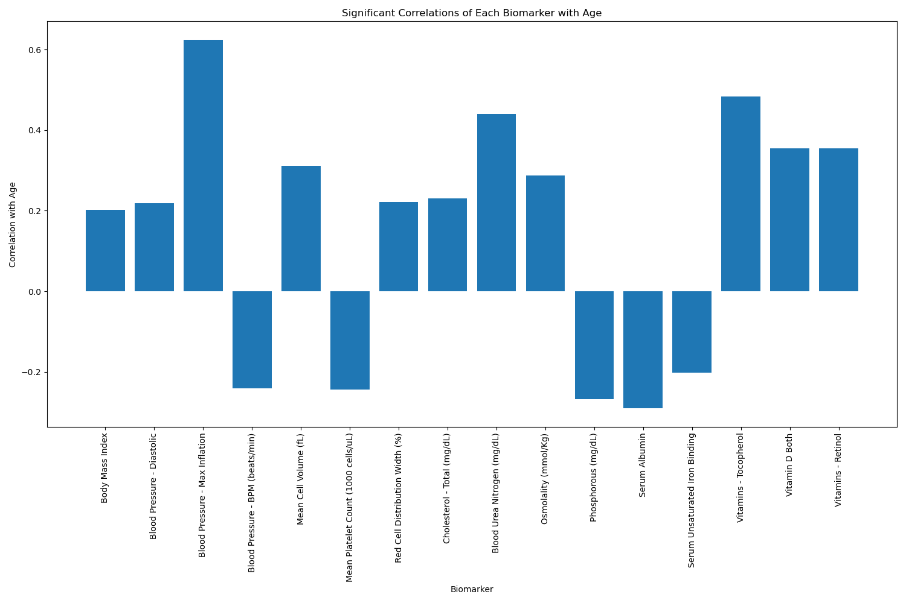
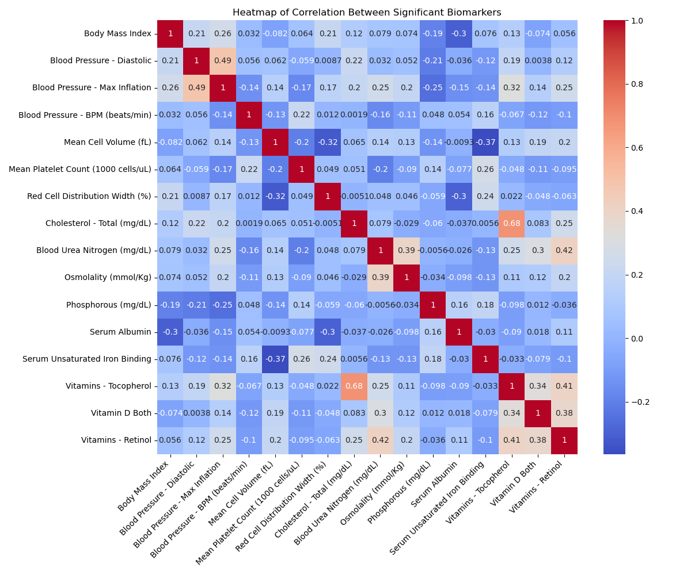
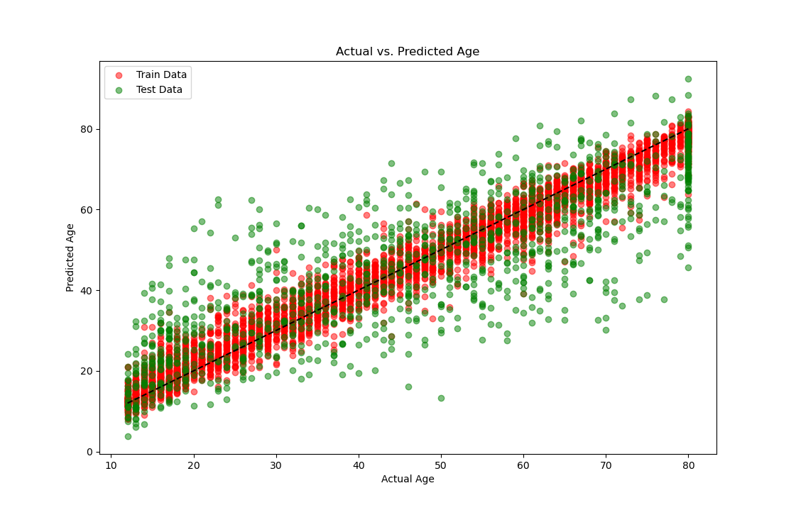
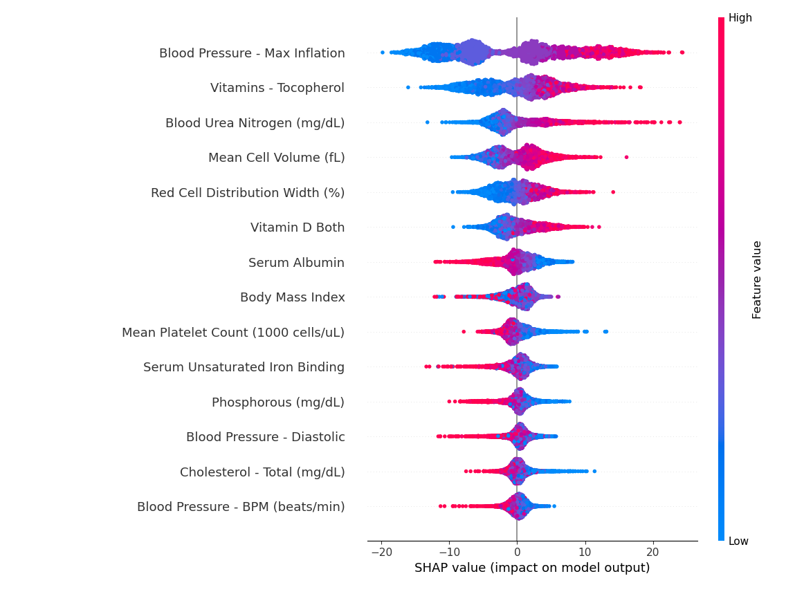

# Hunting for a Longevity Test under $100 with Data Science

Longevity science has been one of my top obsessions this last decade or so, up there with Cybersecurity, AI/ML and Geo/Politics. Recently, thanks to [this episode of The Sheekey Science Show](https://www.youtube.com/watch?v=tnprZMe3vYI), I came across Aaron King's [AgeRank](http://agerank.com), a website that compiles a vast dataset of human medical tests and lets you see how different biomarkers change with age.

From one of his Linkedin posts on the price of testing different biomarkers, this challenge stuck with me "We'll see if it's possible to find an array for under $100" (Morgan Levine's PhenoAge may make the cut here but still, epigenetic tests are double that).

## Data Preprocessing

First I downloaded all the datasets. Since 2017 had the most biomarkers and I wanted to avoid inconsistencies I stuck with those. I merged them into one big CSV and progresively removed rows with few biomarkers and columns with few samples. This left me with 110 biomarkers and 6310 measurements.

## Correlation With Age

Then I checked which biomarkers correlated with age and kept those who had a significant correlation and an absolute correlation value greater than 0.2. 

Finally to deduplicate them I did a correlation matrix among themselves. Finally from those biomarkers that were significantly correlated among themselves with a value greater than 0.8 I'd kept the one that had better correlation to age or more samples.

A caveat here is that we don't really want to predict the age, but measure healthy aging, we try to predict age and asume that lower results would be better.

## Removing Outliers

After doing some dimensionality reduction (Principal Component Analysis PCA and UMAP) and ploting it coloured by age I could already see some patterns, but still we clearly had some outliers and skewed distributions.

By colouring it by each biomarker I saw that some groups were too high on some of them. I checked for skewness of the distribution of each biomarker and kept those that had a somewhat normal distribution. 
After removing the offending biomarkers plots were looking much better and data was already arranging istelf by age.

Caveat 2: The biomarkers that were more skewed were maily the ones meassuring heavy metals, inflamation and metabolic issues. We still probably want to check we are good on those, this has left me with an novel fear of cadmium.

## Pricing

So far I hadn't checked on prices, I was suprised to find out that testing for vitamins is absurdly expensive relative to other blood tests. So we also drop Osmolality, Retinol (Vit. A) and DXA. We keep Tocopherol (Vit. E) because of it's super predictive powers (?).

## Predicting Age

Finally we build a Gradient Boost model to predict age from the biomarkers measurement. We use 80% of the data as training and keep 20% to test on unknown data. I did not do any hyperparameter fine-tunning
and kept it with the default parameters given by ChatGPT.

This gives us a Mean Absolute Error of 9.4 (+-years) and a significant Correlation of 0.815.

The final price is:
- Complete Blood Count $8.50 
- Lipid Panel $8
- Comprehensive Metabolic Panel $8.50
- Phosphorus $5
- Iron Panel $8
- Vitamin E - Tocopherol $40
- Vitamin D (25-Hydroxy) $14.50
- BMI and Blood Preasure negligible.

Totaling $92.50

We did it!! 

While this exercise demonstrates the potential of data science in longevity research, it's important to note that my understanding of human biology is limited. Professional insight is crucial for any practical application of these findings. That said I'd be very happy if someone with formal training uses this as a basis to build upon based on informed reasoning.

I did this with minimal coding, primarily by asking ChatGPT for code snippets and then making minor modifications for debugging or small adjustments. All the code, [prompts](https://github.com/sudoaza/jupyter-notebooks/agerank/prompts.txt) (which are straightforward), and data will be shared in [this GitHub repository](https://github.com/sudoaza/jupyter-notebooks/agerank).
